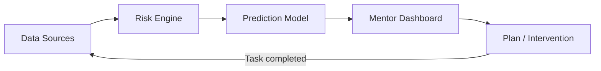

# Drishya

**An explainable, signal-based early-warning system for student mentors.**

Drishya continuously tracks academic and engagement signals for every student in a cohort, converts them into a transparent risk score, forecasts where each student is headed, and closes the loop by turning risk into action — automatically.

---

## Table of Contents

- [Why Drishya](#why-drishya)
- [How It Works](#how-it-works)
- [Features](#features)
- [API Reference](#api-reference)
- [Getting Started](#getting-started)
- [Authentication](#authentication)
- [Testing](#testing)
- [Project Status & Roadmap](#project-status--roadmap)
- [Tech Stack](#tech-stack)

---

## Why Drishya

Academic decline is gradual, but institutional response is not. A student's grades, attendance, and engagement erode over weeks — sometimes months — before a mentor, advisor, or system takes notice. By then, the intervention window has already narrowed from course correction to damage control.

This isn't a data problem. Most institutions already collect attendance, grades, and activity logs. It's a **synthesis problem** — nobody is continuously converting scattered signals into a single, explainable answer to the question every mentor actually needs answered:

> *"Which of my students needs me this week, and why?"*

**Why existing tools fall short:**

| Tool | Limitation |
|---|---|
| LMS platforms | Reactive — grades are visible only after they're posted, no forward view |
| Spreadsheets / manual check-ins | Doesn't scale past a handful of students, no memory of prior state |
| Generic analytics dashboards | Numbers without reasoning — a risk score with no explanation isn't actionable |

The need isn't more data. It's a system that **watches continuously, explains itself, and closes the loop back to action.**

---

## How It Works



1. **Track** — attendance, grade trends, syllabus completion, spaced-repetition recall, and coding activity are pulled continuously.
2. **Score** — a transparent, weighted risk engine converts raw signals into a single 0–100 score, with every contributing factor shown in plain language.
3. **Predict** — forward-looking exam and GPA forecasts, based on real trend data.
4. **Act** — auto-generated study plans and mentor interventions turn risk into a concrete next step.
5. **Close the loop** — completing a plan task automatically resets activity recency and re-triggers risk recalculation, so the system never goes stale.

---

## Features

- **Explainable risk scoring** — every score ships with a full weighted breakdown (score gap, syllabus completion, activity recency, grade trend, coding activity), not just a number.
- **Forecasting** — per-subject exam score projection and overall GPA trajectory, computed from real historical trend data.
- **Spaced-repetition tracking** — SM-2–based review scheduling per topic (interval, ease factor, repetitions).
- **Auto-generated study plans** — daily targets tied to each student's specific risk factors.
- **Mentor intervention workflow** — a real approval/dismissal loop, role-gated by `X-User-Role`.
- **Conversational access** — a chat endpoint grounded in each student's actual state, not generic responses.
- **Career signals** — internship matching and coding-platform activity (Codeforces), with graceful offline fallback.
- **Cohort ingestion** — bulk-load an entire class from a single spreadsheet upload.
- **Demo tooling** — endpoints to simulate live risk drift and reset to seed state, built specifically for presentations.

---

## API Reference

All endpoints are prefixed with `/api/v1`. Interactive documentation is available at `/docs` (Swagger UI) whenever the server is running.

### Students

| Method | Endpoint | Description |
|---|---|---|
| `GET` | `/students` | List all students, filterable by risk band, sortable, paginated |
| `GET` | `/students/{student_id}/state` | Full unified profile: grades, attendance, risk, and predictions |
| `GET` | `/students/{student_id}/risk` | Standalone risk score and explanation |
| `GET` | `/students/{student_id}/predictions` | Exam forecasts and projected GPA |
| `GET` | `/students/{student_id}/plan` | Current auto-generated study plan |
| `POST` | `/students/{student_id}/plan/generate` | Generate/regenerate a study plan |
| `POST` | `/students/{student_id}/tasks/{task_id}/complete` | Mark a task complete — triggers activity recency update and automatic risk recalculation |

### Retention (Spaced Repetition)

| Method | Endpoint | Description |
|---|---|---|
| `GET` | `/students/{student_id}/reviews` | SM-2 review schedule, optionally filtered to items due now |
| `POST` | `/students/{student_id}/reviews/{topic}/grade` | Record a review outcome and reschedule the next review |

### Career Signals

| Method | Endpoint | Description |
|---|---|---|
| `GET` | `/students/{student_id}/internships` | Matched internship opportunities |
| `GET` | `/students/{student_id}/coding` | Codeforces profile stats (offline-safe, never 500s) |

### Interventions

| Method | Endpoint | Description |
|---|---|---|
| `GET` | `/interventions` | List pending and historical intervention alerts |
| `POST` | `/interventions/{intervention_id}/review` | Mentor approval/dismissal of an intervention |

### Conversational

| Method | Endpoint | Description |
|---|---|---|
| `POST` | `/chat` | Chat with an AI mentor, grounded in the student's real state |

### Cohort Management

| Method | Endpoint | Description |
|---|---|---|
| `POST` | `/ingest` | Upload and ingest a cohort dataset (Excel) |

### Demo Tooling

| Method | Endpoint | Description |
|---|---|---|
| `POST` | `/demo/drift-hero` | Simulate a live risk-drift scenario for presentations |
| `POST` | `/demo/reset` | Reset the store to seed state |

---

## Getting Started

### Prerequisites

- Python 3.10+
- `pip`

### Installation

```bash
git clone <repository-url>
cd Student-AI-Mentor
pip install -r requirements.txt
```

### Running the server

```bash
uvicorn backend.main:app --reload --port 8000
```

The API will be available at `http://127.0.0.1:8000`, and interactive Swagger docs at `http://127.0.0.1:8000/docs`.

---

## Authentication

All endpoints require an API key, passed via header:

```
X-API-Key: <your-key>
```

Some endpoints additionally check a role header for access control:

```
X-User-Role: mentor | student
X-User-Id: <student-or-mentor-id>
```

In Swagger UI, click **Authorize** (top right) and enter your API key once — it will be attached to every subsequent request automatically.

---

## Testing

```bash
python -m pytest
```

The test suite covers risk calculation, interventions, role gating, and end-to-end behavior across the API.

---

## Project Status & Roadmap

This project is under active development. Known in-progress items:

- [ ] Move exam/GPA forecasting from linear extrapolation to a damped-growth model that reconciles projected GPA against current CGPA
- [ ] Full field-parity audit between `StudentState` and the chat context builder (some fields are not yet surfaced to the conversational layer)
- [ ] Mentor-facing dashboard UI
- [ ] Expanded coding-activity and project-based risk signals

---

## Tech Stack

- **Backend:** FastAPI (Python)
- **API Docs:** OpenAPI / Swagger UI (auto-generated)
- **Data ingestion:** Excel (via `openpyxl` / `pandas`)
- **Spaced repetition:** SM-2 algorithm
- **Testing:** pytest
